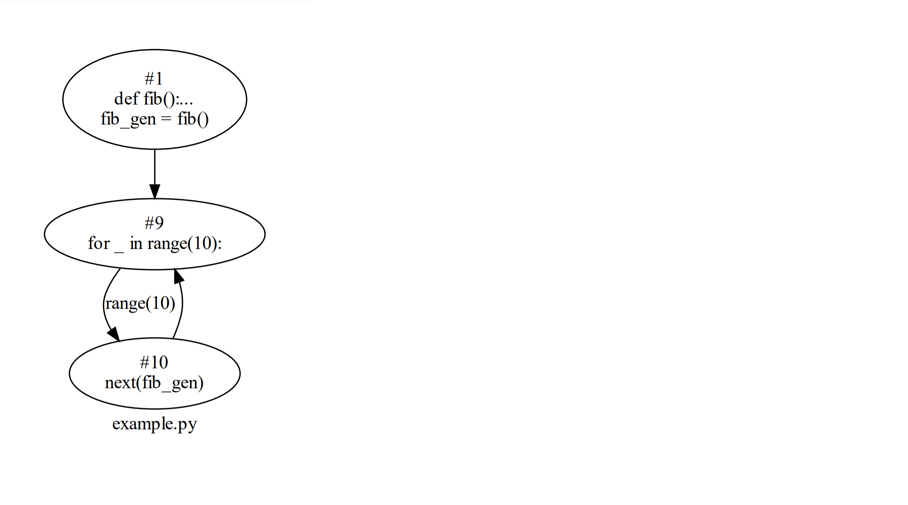
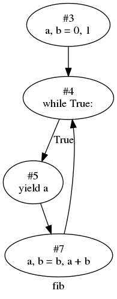

# Control Flow Graph
The control-flow graph(CFG) construction module generates intra-procedural CFGs, which are an essential component in static flow analysis with applications such as program optimization and taint analysis. A CFG represents all paths that might be traversed through a program during its execution. The CFGs of a Python project can be combined with the call graph to generate an inter-procedural CFG of the project.

`scalpel.cfg` module is used to construct the control flow graph for given Python programs. The basic unit in the CFG, `Block`, contains a list of sequential statements that can be executed in a program without any control jumps. The `Block`s are linked by `Link` objects, which represent control flow jumps between two blocks and contain the jump conditions in the form of an expression. The two components are the fundamental data structures in the control flow graph module (`scalpel.cfg`).


## How to use Control Flow Graph
Below is the demo input Python program we will be using. The piece of code generates the Fibonacci sequence.
```python
code_str="""
def fib():
    a, b = 0, 1
    while True:
        yield a
        a, b = b, a + b

fib_gen = fib()
for _ in range(10):
    next(fib_gen)
"""
```
To build the cfg of a source string, simply import `CFGBuilder` in `scalpel.cfg` and use `build_from_src(name, file_path)`. Other functions can also be used to build a cfg from an python AST tree or a source file.

```python
from scalpel.cfg import CFGBuilder

cfg = CFGBuilder().build_from_file('example.py', './example.py')

```
This returns the CFG for the code in *./example.py* in the cfg variable. This built CFG can be visualized with `build_visual`:
```python
cfg.build_visual('pdf')
```
Below is the produced *exampleCFG.pdf*.

|  |
|:--:|
| <b>Fig.1 The control flow graph for the given source files </b>|


Apart from generating the visual graph, the CFG can be used for many other static analysis purposes.
For example, `get_calls` can be used to get all function calls in each block.
```python
for block in cfg:
    calls = block.get_calls()
```

## Visualizations of CFG objects

Scalpel offerers some functionalities to render the CFG diagrams into PDF, PNG, JPG or SVGs. Please notice this requires the graphviz package installed on your computer. Please refer to [graphviz](https://graphviz.readthedocs.io/en/stable/manual.html) to get it installed. 

Developers can use ```cfg.build_visual()``` to build an ```graphviz.dot.Digraph``` object, then call ```render``` function to generate the image file as shown in the following code snippet.

```python
dot = fun_cfg.build_visual('png')
dot.render("cfg_diagram", view=False)
```

## Visiting Function CFGs

In theory, there are no control flow constraints between subprocedures such as functions. Therefore, Scalpel generates control flow graphs for every function in the given source files. Considering the nested structure of Python class and function definition, we integrate recursive data structure for storing control flow graphs.

Take the above source code for example, scalpel will generate two CFGs, one is shown in fig. 1 , and the other is for the function ```fib```. 

we can use the following way to visit all the function cfgs in the given source. 

Please note that function cfgs can be indexed by both the function name and its block id. This is due to Python language allows users to define functions with the same names in the same domain such as:

```python
x = 0
if some condition:
   def solve():
       ...
else:
   def solve():
       ...
solve(x)
```

The implementation of the function ```solve``` can be different depending the actual condition. Therefore, we need more than function name to index a function CFG. Now, if we take the fig. 1 for example, we can visit all function CFGs in the following way and try to create a pdf file for the diagram of CFG of function ```fib```: 


```python
for (block_id, fun_name), fun_cfg in cfg.functioncfgs.items():
    ... # do something
    if fun_name == "fib":
        graph = fun_cfg.build_visual('png')
        graph.render("fig_cfg", view=False) 
```

|  |
|:--:|
| Fig.2 The control flow graph for the function ```fib``` |

Please note, as there might be functions defined inside a function definition, you can continue to perform a similar operation on the ```fun_cfg``` to retrieve the nested function CFGs. These CFGs can be combined for analysis. 


\
The tutorial code can be found here:\
&nbsp;&nbsp;&nbsp;&nbsp;&nbsp;&nbsp;[Control Flow Graph Example](../examples/cfg_tutorial.py)


## APIs
Please refer to the API documentation: {py:mod}`scalpel.cfg`

## Reference
1. [StaticCFG](https://github.com/coetaur0/staticfg).
2. [ECE 5775 High-Level Digital Design Automation](https://www.csl.cornell.edu/courses/ece5775/pdf/lecture06.pdf), Cornell University
3. [CS153: Compilers](https://groups.seas.harvard.edu/courses/cs153/2018fa/lectures/Lec17-CFG-dataflow.pdf), Harvard University
