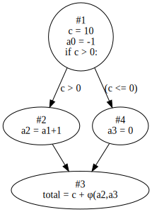

# SSA & Constant Propagation

Static Single Assignment (SSA) is a technique of IR in the compiling thoery, it also shows great benefits to static anaysis tasks such as constant propagation, dead code elimination and etc.

Constant propagation is also a matured technique in static anaysis. It is the process of evaluating or recognizing the actual constant values or expressions at a particular program point. This is realized by utilizing control flow and data flow information. Determining the possible values for variables before runtime gives great benefits to software anaysis. For instance, with constant value propagation, we can detect and remove dead code or perfrom type checking. 

Alias anaysis is to locate the variable pairs in the source code that point to the same location of memory. This can be useful to flow-sensitive anaysis of data flows. 

 
In scalpel, we implement constant propagation along with the SSA for execution efficiency.

## How to use the SSA and Constant Propagation module 

The demo input python program we will be using is as follows.
```python
code_str="""
c = 10
a = -1
if c>0:
    a = a+1
else:
    a = 0
total = c+a
"""
```
It can be seen from the above code, the variable `a` has two possible values. By utilizing the phi functions in SSA, we are able to infer that the actual return value will have two potential values. We follow the algorithms from [4]. The input parameter for SSA computing is the CFG as it represents how the code blocks are organized in the program execution flow. 

```python
# create a mnode object.
mnode = MNode("local")
# feed the code snippet
mnode.source = code_str 
mnode.gen_ast()
# get the cfg
cfg = mnode.gen_cfg() 
m_ssa = SSA()
# do the job
ssa_results, const_dict = m_ssa.compute_SSA(cfg) 
for block_id, stmt_res in ssa_results.items():
  print("These are the results for block ".format(blck_id))
  print(stmt_res)
for name, value in const_dict.items():
  print(name, value)
print(ssa_results)

```

Please note that the funciton `compute_SSA` returns two dictionaries. For the first one, the key values are block numbers in the given CFG, the value is a list of dictioanaries, each of which corresponds to one statement in the block. For instance, the `ssa_results[3]` (block id is `3` in this casse ) is a list of SSA representations for the last block. If we inspect the the last block ( the variable `total` is assigned), the results are 

```python
 3: [{'c': {0}, 'a': {1, 2}}]
```
This is due to that the variable `a` can take values from two assignments. This is can be easily observed from the following diagram. 





The second one named `const_dict` is the global constant values for the numbered identifiers. For instance, `const_dict["(a,0)"]` is the constant value after the first assignment to variable `a`. The constant values in this module are instances of Python ```ast.expr```. In this participular case `(a,0)` is an `ast.BinOp` type and `(a,1)` is an `ast.Num` type.
The tutorial code can be found here:
&nbsp;&nbsp;&nbsp;&nbsp;&nbsp;&nbsp;[SSA_example.py](example.com)


## How to implement alias anaysis.

As stated above, the `const_dict` stores the all values that are assigned to given variable (renamed in this situation), therefore, alias pairs can be implemented in an simple way. The idea is to scan all the values for a particular variable and see if the value assgined to the variable is an `ast.Name` object. The following code snippet shows how to find out the alias pair in the above.

```python
# create a mnode object.
mnode = MNode("local")
# feed the code snippet
mnode.source = code_str 
mnode.gen_ast()
# get the cfg
cfg = mnode.gen_cfg() 
m_ssa = SSA()
# do the job
ssa_results, const_dict = m_ssa.compute_SSA(cfg) 
alias_name_pairs = []
for name, value in const_dict.items():
  if isinstance(value, ast.Name):
    alias_name_pairs.append((name, value.id))
```

## APIs

Please refer to the API documentation: {any}`scalpel.SSA`


## Reference
1. [A Simple, Fast Dominance Algorithm](https://www.cs.rice.edu/~keith/EMBED/dom.pdf) Keith D. Cooper, Timothy J. Harvey, and Ken Kennedy
2. [COS598C Advanced Compilers](https://www.cs.princeton.edu/courses/archive/spr04/cos598C/lectures/02-ControlFlow.pdf), Princeton University
3. [CMU 15-411 Compiler Design](https://www.cs.cmu.edu/~fp/courses/15411-f08/lectures/09-ssa.pdf)
4. [Harvard CS252r Spring 2011](https://groups.seas.harvard.edu/courses/cs252/2011sp/slides/Lec04-SSA.pdf)
